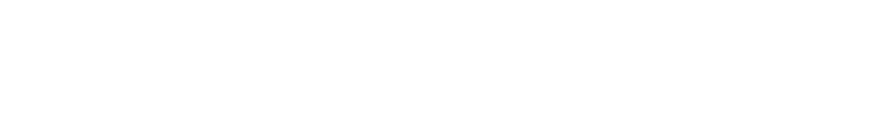
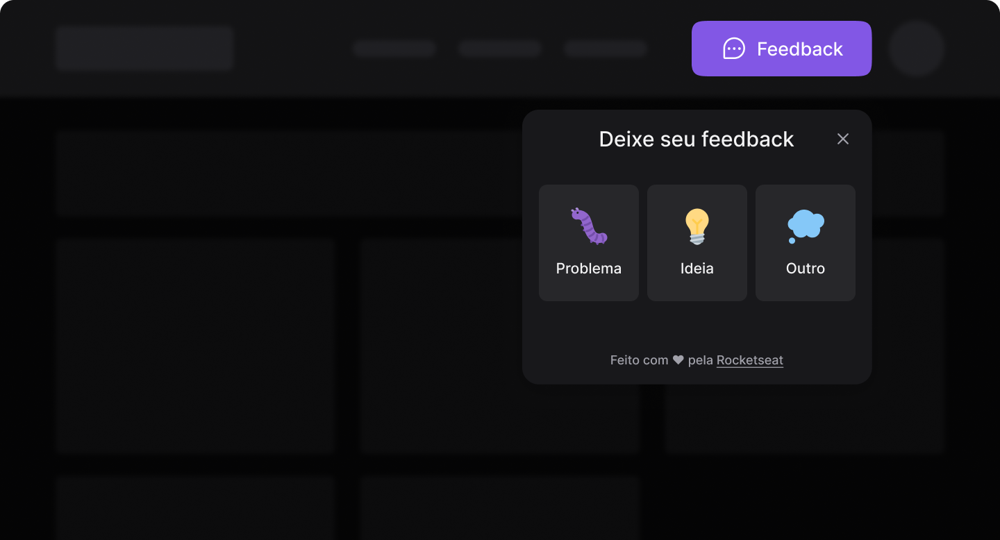

<p align="center">
  
</p>

<h1 align="center">
  
  
  
  <a href="http://commitizen.github.io/cz-cli/">
    
  </a>
  <a href="./LICENSE.md">
    
  </a>
</h1>
<br>

## 📝 Descrição

Projeto de criação de um Widget de Feedbacks desenvolvido na Next Level Week #8 promovida pela [RocketSeat](https://www.rocketseat.com.br/).

<br>

## 🖌 Layout

<p align="center">
  
</p>

Para conhecer o layout do projeto acesse o link abaixo. 

[Feedback Widget - Figma](https://www.figma.com/file/2RYxnSJLgW5lZU7fRgOPxG/Feedback-Widget)

<br>
<!-- 
## Documentação da API

<br>

#### Retorna todos os itens

```http
  GET /api/items
```

| Parâmetro   | Tipo       | Descrição                           |
| :---------- | :--------- | :---------------------------------- |
| `api_key` | `string` | **Obrigatório**. A chave da sua API |

<br>

#### Retorna um item

```http
  GET /api/items/${id}
```

| Parâmetro   | Tipo       | Descrição                                   |
| :---------- | :--------- | :------------------------------------------ |
| `id`      | `string` | **Obrigatório**. O ID do item que você quer |

<br>

#### add(num1, num2)

Recebe dois números e retorna a sua soma.

<br>

## Instalação

Instale my-project com npm

```bash
  npm install my-project
  cd my-project
```

<br>

## Rodando localmente

Clone o projeto

```bash
  git clone https://link-para-o-projeto
```

Entre no diretório do projeto

```bash
  cd my-project
```

Instale as dependências

```bash
  npm install
```

Inicie o servidor

```bash
  npm run start
```

<br>
 -->

## 🛠 Melhorias

Para andar a milha extra foram acrescentadas algumas melhorias, tanto referentes ao código quanto a aplicação em si.

### 📌 Troca do serviço de email para um serviço de email em produção. 
- Para essa melhoria foi escolhido o serviço de email [SendGridMail](https://sendgrid.com/)
- O plano gratuito permite integração com até 100 emails por dia.


<br>

## ⚙️ Stack utilizada

### 📌 Front-end
- [React](https://pt-br.reactjs.org)
- [TailwindCSS](https://tailwindcss.com)

### 📌 Back-end
- [Node](https://nodejs.org)
- [Express](https://expressjs.com/pt-br)
- [Typescript](https://www.typescriptlang.org)

### 📌 Deploy
- [Vercel](https://vercel.com) para Frontend
- [Railway](https://railway.app) para Backend

<br>

## 👩‍💼 Autora


<p><b>Nádia Ligia, budding back-end developer.</b></p>
<a href="https://www.linkedin.com/in/nlnadialigia/">
  
</a>&nbsp;
<a href="mailto:nlnadialigia@gmail.com">
  
</a>&nbsp;
<a href="https://www.nlnadialigia.com">
  
</a>